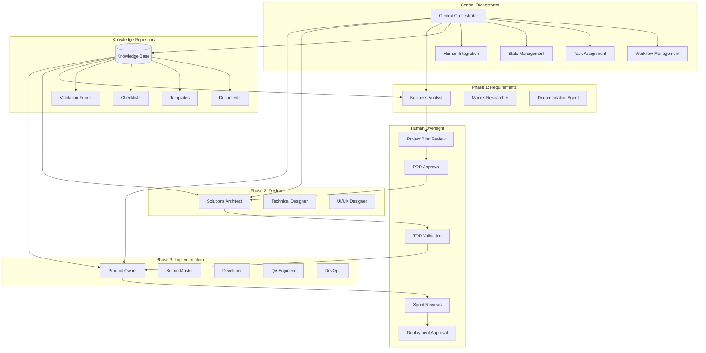
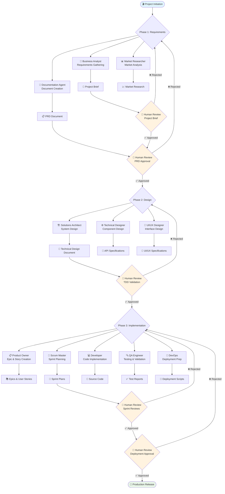

# Multi-Agent SDLC System

## Overview
This directory contains the foundational knowledge base for the Multi-Agent SDLC System. All agents have read/write access to this centralized repository.

This repository contains the foundational knowledge base for an advanced **Multi-Agent Software Development Life Cycle (SDLC) System** designed to automate and streamline the entire software development process from initial scoping to deployment, with robust human oversight and collaboration.

The system orchestrates specialized AI agents across three distinct phases, each with defined roles, responsibilities, and quality gates, ensuring high-quality software delivery while maintaining human control at critical decision points.

## SDLC Phases Explained

### **Phase 1: Scoping & Requirements Engineering**
- **Objective:** Analyze project requirements, conduct research, and produce a detailed project brief and Product Requirements Document (PRD).
- **Key Agents:** Business Analyst, Market Researcher, Documentation Agent
- **Outputs:** Project_Brief.md, PRD.md
- **Human Input:** Mandatory review and approval of Project Brief and PRD.

### **Phase 2: Technical Design & Architecture**
- **Objective:** Create comprehensive technical design documentation (TDD) based on approved requirements.
- **Key Agents:** Solutions Architect, Technical Designer
- **Outputs:** TDD.md
- **Human Input:** Mandatory review and validation of TDD.

### **Phase 3: Agile Implementation & Delivery**
- **Objective:** Break down designs into Epics and User Stories, manage sprints, implement code, test, and prepare for deployment.
- **Key Agents:** Product Owner, Scrum Master, Developer, QA, DevOps
- **Outputs:** Epics, User Stories, Source Code, Test Reports, Deployment Scripts
- **Human Input:** Human approval required before deployment and at sprint review milestones.
---

## 🏗️ System Architecture


---

## 📋 SDLC Phases Deep Dive

### 🔍 **Phase 1: Scoping & Requirements Engineering**

**Mission:** Transform initial project concepts into comprehensive, validated requirements documentation.

#### Key Agents & Responsibilities:
- **🧠 Business Analyst Agent**
  - Requirement elicitation and stakeholder analysis
  - Functional and non-functional requirement documentation
  - Business process mapping and validation
  
- **📊 Market Researcher Agent**
  - Competitive landscape analysis
  - Market trend identification and validation
  - User persona development and market positioning
  
- **📝 Documentation Agent**
  - Technical writing and document synthesis
  - Stakeholder communication facilitation
  - Quality assurance for all documentation

#### Deliverables:
- **Project_Brief.md** - Executive summary, vision, and scope
- **PRD.md** - Comprehensive Product Requirements Document
- **Market_Research_Summary.md** - Competitive analysis and market insights

#### Human Checkpoints:
- ✅ **Project Brief Review** - Stakeholder alignment validation
- ✅ **PRD Approval** - Requirements sign-off and scope confirmation

---

### 🏛️ **Phase 2: Technical Design & Architecture**

**Mission:** Transform approved requirements into comprehensive technical specifications and system architecture.

#### Key Agents & Responsibilities:
- **🏗️ Solutions Architect Agent**
  - High-level system architecture design
  - Technology stack selection and evaluation
  - Scalability and performance planning
  
- **⚙️ Technical Designer Agent**
  - Detailed component design and specifications
  - API design and data modeling
  - Integration patterns and technical workflows
  
- **🎨 UI/UX Designer Agent**
  - User experience design and flow optimization
  - Interface design and design system creation
  - Accessibility and usability standards

#### Deliverables:
- **TDD.md** - Technical Design Document
- **UIUX_Spec.md** - User Interface/Experience Specifications
- **Architecture_Diagrams** - System architecture visualizations

#### Human Checkpoints:
- ✅ **TDD Validation** - Technical feasibility and architecture review
- ✅ **Design Approval** - UI/UX and technical design sign-off

---

### 🚀 **Phase 3: Agile Implementation & Delivery**

**Mission:** Execute approved designs through structured agile development cycles with continuous quality assurance.

#### Key Agents & Responsibilities:
- **📋 Product Owner Agent**
  - Epic and user story creation
  - Backlog prioritization and management
  - Acceptance criteria definition
  
- **🎯 Scrum Master Agent**
  - Sprint planning and execution
  - Team coordination and impediment removal
  - Agile process optimization
  
- **💻 Developer Agent**
  - Code implementation and unit testing
  - Technical documentation maintenance
  - Code review and quality assurance
  
- **🔍 QA Agent**
  - Test planning and execution
  - Defect tracking and resolution
  - Quality metrics and reporting
  
- **🔧 DevOps Agent**
  - CI/CD pipeline management
  - Infrastructure provisioning and monitoring
  - Deployment automation and rollback procedures

#### Deliverables:
- **Epics/** - High-level feature groupings
- **User_Stories/** - Detailed implementation tasks
- **Source Code** - Production-ready application code
- **Test Reports** - Quality assurance documentation
- **Deployment Scripts** - Infrastructure and deployment automation

#### Human Checkpoints:
- ✅ **Sprint Reviews** - Feature acceptance and quality validation
- ✅ **Deployment Approval** - Production release authorization

---

### Directory Tree Structure


```bash
multi-agent-synthesis/
├── Knowledge_Repository/                    # 📚 Foundational documents
│   ├── README.md                           # 🗂️ Master index and system overview
│   ├── System_Architecture_Overview.md     # 🏗️ High-level system architecture
│   ├── Orchestrator_And_Workflow_Guide.md  # 🎭 Central orchestrator functionality
│   ├── Quality_Standards_And_Template_Catalog.md # ⭐ Quality framework
│   ├── Coding_Standards.md                 # 💻 Development standards
│   ├── Design_System_Principles.md         # 🎨 UI/UX design principles
│   └── Knowledge_Base.md                   # 📊 Knowledge base management
├── Agents/                                 # 👥 Individual agent specifications
│   ├── Business_Analyst.md                # 🧠 Requirements analysis agent
│   ├── Developer.md                       # 💻 Code implementation agent
│   ├── Product_Manager.md                 # 📊 Product strategy agent
│   ├── Product_Owner.md                   # 📋 Backlog management agent
│   ├── Project_Manager.md                 # 📈 Project coordination agent
│   ├── Scrum_Master.md                    # 🎯 Agile facilitation agent
│   ├── Solutions_Architect.md             # 🏗️ System architecture agent
│   └── UIUX_Designer.md                   # 🎨 Interface design agent
├── Templates/                              # 📋 Document templates for SDLC artifacts
│   ├── Project_Brief_Template.md          # 📝 Project vision and scope
│   ├── PRD_Template.md                    # 📋 Product requirements document
│   ├── TDD_Template.md                    # 📐 Technical design document
│   ├── Epic_Template.md                   # 📖 Feature epic template
│   ├── User_Story_Template.md             # 📄 User story template
│   ├── UIUX_Spec_Template.md              # 🎨 UI/UX specifications
│   ├── Front_End_Architecture_Template.md # 💻 Frontend architecture
│   ├── Infrastructure_Architecture_Template.md # 🏗️ Infrastructure design
│   └── Doc_Sharding_Template.md           # 📚 Document organization
├── Checklists/                            # ✅ Validation checklists for quality
│   ├── Requirements_Analysis_Checklist.md # 🔍 Requirements validation
│   ├── Architect_Checklist.md             # 🏗️ Architecture validation
│   └── Story_DoD_Checklist.md             # ✅ Definition of done
├── Validation_Forms/                       # 📝 Approval forms for human review
│   ├── PRD_Approval_Form.md               # 📋 PRD review and approval
│   └── Sprint_Review_Form.md              # 🏃 Sprint completion validation
├── Workflow_Procedures/                    # 🔄 Step-by-step process guides
│   ├── Create_Architecture.md             # 🏗️ Architecture creation workflow
│   └── Create_Next_Story_Task.md          # 📄 User story creation process
├── Epics/                                 # 📖 High-level feature groupings
└── User_Stories/                          # 📄 Detailed implementation tasks
```

---

## 🔄 Complete Workflow Visualization



---

## 📁 Repository Structure

```mermaid
graph TD
    Root["🏠 multi-agent-synthesis/"]
    
    Root --> KB["📚 Knowledge_Repository/"]
    Root --> Agents["👥 Agents/"]
    Root --> Templates["📋 Templates/"]
    Root --> Checklists["✅ Checklists/"]
    Root --> Forms["📝 Validation_Forms/"]
    Root --> Workflow["🔄 Workflow_Procedures/"]
    Root --> Epics["📖 Epics/"]
    Root --> Stories["📄 User_Stories/"]
    
    %% Knowledge Repository Files
    KB --> ARCH["🏗️ System_Architecture_Overview.md"]
    KB --> ORCH["🎭 Orchestrator_And_Workflow_Guide.md"]
    KB --> QUAL["⭐ Quality_Standards_And_Template_Catalog.md"]
    KB --> CODE["💻 Coding_Standards.md"]
    KB --> DESIGN["🎨 Design_System_Principles.md"]
    KB --> BASE["📊 Knowledge_Base.md"]
    
    %% Agents Files
    Agents --> BA_A["🧠 Business_Analyst.md"]
    Agents --> DEV_A["💻 Developer.md"]
    Agents --> PM_A["📊 Product_Manager.md"]
    Agents --> PO_A["📋 Product_Owner.md"]
    Agents --> PMG_A["📈 Project_Manager.md"]
    Agents --> SM_A["🎯 Scrum_Master.md"]
    Agents --> SA_A["🏗️ Solutions_Architect.md"]
    Agents --> UX_A["🎨 UIUX_Designer.md"]
    
    %% Templates Files
    Templates --> PRD_T["📋 PRD_Template.md"]
    Templates --> TDD_T["📐 TDD_Template.md"]
    Templates --> EPIC_T["📖 Epic_Template.md"]
    Templates --> STORY_T["📄 User_Story_Template.md"]
    Templates --> BRIEF_T["📝 Project_Brief_Template.md"]
    Templates --> UIUX_T["🎨 UIUX_Spec_Template.md"]
    Templates --> INFRA_T["🏗️ Infrastructure_Architecture_Template.md"]
    Templates --> FRONTEND_T["💻 Front_End_Architecture_Template.md"]
    Templates --> DOC_T["📚 Doc_Sharding_Template.md"]
    
    %% Checklists Files
    Checklists --> REQ_C["✅ Requirements_Analysis_Checklist.md"]
    Checklists --> ARCH_C["🏗️ Architect_Checklist.md"]
    Checklists --> DOD_C["✅ Story_DoD_Checklist.md"]
    
    %% Validation Forms Files
    Forms --> PRD_F["📝 PRD_Approval_Form.md"]
    Forms --> SPRINT_F["🏃 Sprint_Review_Form.md"]
    
    %% Workflow Procedures Files
    Workflow --> CREATE_ARCH["🏗️ Create_Architecture.md"]
    Workflow --> CREATE_STORY["📄 Create_Next_Story_Task.md"]
    
    %% Styling
    style Root fill:#e3f2fd,stroke:#1976d2,stroke-width:3px
    style KB fill:#f3e5f5,stroke:#7b1fa2,stroke-width:2px
    style Agents fill:#e8f5e8,stroke:#388e3c,stroke-width:2px
    style Templates fill:#fff3e0,stroke:#f57c00,stroke-width:2px
    style Checklists fill:#e0f2f1,stroke:#00695c,stroke-width:2px
    style Forms fill:#fce4ec,stroke:#c2185b,stroke-width:2px
    style Workflow fill:#f1f8e9,stroke:#558b2f,stroke-width:2px
    style Epics fill:#fff8e1,stroke:#ffa000,stroke-width:2px
    style Stories fill:#e8eaf6,stroke:#3f51b5,stroke-width:2px
``` 



---

## 🎯 Foundational Documents

### 🏗️ System Architecture & Design
- **[System_Architecture_Overview.md](./System_Architecture_Overview.md)** - Complete system architecture, components, and data flow
- **[Orchestrator_And_Workflow_Guide.md](./Orchestrator_And_Workflow_Guide.md)** - Central orchestrator functionality and workflow management

### ⭐ Quality & Standards
- **[Quality_Standards_And_Template_Catalog.md](./Quality_Standards_And_Template_Catalog.md)** - Comprehensive quality framework and template catalog
- **[Coding_Standards.md](./Coding_Standards.md)** - Development standards, best practices, and code quality guidelines
- **[Design_System_Principles.md](./Design_System_Principles.md)** - UI/UX design principles and system guidelines

### 📊 Knowledge Base Management
- **[Knowledge_Base.md](./Knowledge_Base.md)** - Knowledge repository structure and management protocols

## Directory Structure Reference
- **[../Agents/](../Agents/)** - Individual agent specifications and personas
- **[../Templates/](../Templates/)** - Document templates for all SDLC artifacts
- **[../Checklists/](../Checklists/)** - Validation checklists for quality assurance
- **[../Validation_Forms/](../Validation_Forms/)** - Approval forms for human review

## Purpose
These documents serve as the single source of truth for:
- System architecture and component relationships
- Workflow orchestration and agent coordination
- Quality standards and validation procedures
- Development and design guidelines
- Template and checklist catalogs

| Directory | Purpose | Key Contents |
|-----------|---------|--------------|
| **[../Agents/](../Agents/)** | 👥 Agent Specifications | Individual agent personas, responsibilities, and interaction patterns |
| **[../Templates/](../Templates/)** | 📋 Document Templates | Standardized templates for all SDLC artifacts and deliverables |
| **[../Checklists/](../Checklists/)** | ✅ Quality Checklists | Validation checklists ensuring quality and completeness |
| **[../Validation_Forms/](../Validation_Forms/)** | 📝 Approval Forms | Human review and approval workflow documentation |
| **[../Workflow_Procedures/](../Workflow_Procedures/)** | 🔄 Process Guides | Step-by-step procedures for complex workflows |
| **[../Epics/](../Epics/)** | 📖 Feature Epics | High-level feature groupings and requirements |
| **[../User_Stories/](../User_Stories/)** | 📄 User Stories | Detailed implementation tasks and acceptance criteria |

---

## 🎯 System Purpose & Benefits

### 🚀 **Core Objectives**
- **Automation:** Streamline repetitive SDLC tasks while maintaining quality
- **Consistency:** Ensure standardized processes across all projects
- **Quality:** Implement robust quality gates and validation procedures
- **Collaboration:** Facilitate seamless human-AI collaboration
- **Scalability:** Support projects of varying complexity and size

### 💡 **Key Benefits**
- **Reduced Time-to-Market:** Accelerated development cycles through automation
- **Enhanced Quality:** Consistent application of best practices and standards
- **Risk Mitigation:** Built-in quality gates and human oversight points
- **Knowledge Preservation:** Centralized documentation and process knowledge
- **Continuous Improvement:** Iterative refinement of processes and outcomes

---

## 📖 Agent Usage Guidelines

### 🔍 **For Requirements Phase Agents:**
- Reference foundational documents for context and standards
- Use standardized templates for all deliverables
- Coordinate through the central orchestrator
- Ensure human review checkpoints are properly flagged

### 🏗️ **For Design Phase Agents:**
- Build upon approved requirements documentation
- Follow established architectural patterns and principles
- Maintain traceability to original requirements
- Validate technical feasibility and scalability

### 🚀 **For Implementation Phase Agents:**
- Adhere to coding standards and quality guidelines
- Maintain awareness of project status and dependencies
- Coordinate sprint activities through the Scrum Master
- Ensure continuous integration and deployment readiness

---

## 🔧 Getting Started

1. **📚 Study the foundational documents** in this Knowledge_Repository
2. **👥 Review your specific agent role** in the Agents directory
3. **📋 Familiarize yourself with templates** and checklists
4. **🎭 Understand the orchestrator** workflow and coordination patterns
5. **🚀 Begin executing** your assigned phase responsibilities

---


## Usage
All agents should reference these documents to:
- Understand their role within the larger system
- Access standardized templates and checklists
- Follow established quality standards
- Coordinate with other agents through the orchestrator 

*This knowledge repository serves as the single source of truth for the Multi-Agent SDLC System, ensuring consistent, high-quality software development through intelligent automation and human collaboration.* 